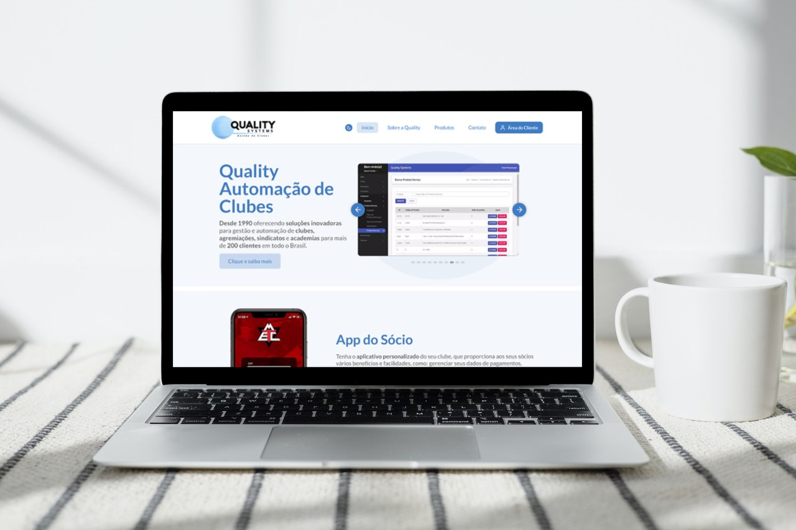

# :desktop_computer: :iphone: Site da empresa Quality Systems

  

A empresa possuía um site antigo e resolvi criar um novo, com um layout moderno, bonito, responsivo, rápido e que fosse altamente indexado pelos motores de busca. Desenvolvi o site com Sass, utilizando o Next.js para alta disponibilidade. Pensei em cada disposição das informações para melhor navegação e experiência do usuário. Todo o site é responsivo, incluse as tabelas.

# Ver projeto: 

## :rocket: Tecnologias
- [x] Figma
- [x] Next.js
- [x] Sass
- [x] date-fns
- [x] react-accessible-accordion
- [x] react-circle-modal
- [x] react-hook-form
- [x] react-toastify
- [x] rerousel
- [x] react-icons
- [x] react-phone-input-2
- [x] react-slideshow-image
- [x] react-tabs
